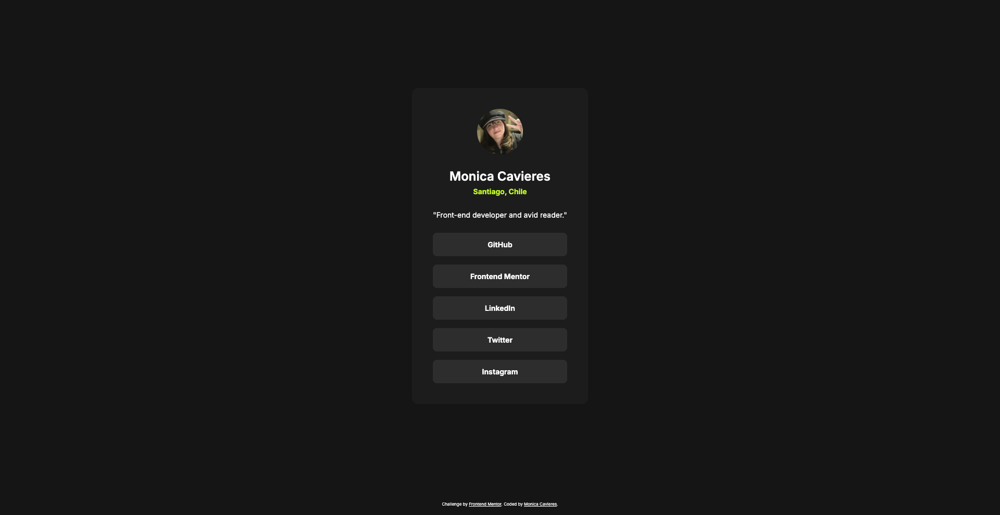

# Frontend Mentor - Blog preview card solution

This is a solution to the [Blog preview card challenge on Frontend Mentor](https://www.frontendmentor.io/challenges/blog-preview-card-ckPaj01IcS). Frontend Mentor challenges help you improve your coding skills by building realistic projects. 

## Table of contents

- [Overview](#overview)
  - [The challenge](#the-challenge)
  - [Screenshot](#screenshot)
  - [Links](#links)
- [My process](#my-process)
  - [Built with](#built-with)
  - [What I learned](#what-i-learned)
  - [Continued development](#continued-development)
- [Author](#author)

**Note: Delete this note and update the table of contents based on what sections you keep.**

## Overview

### The challenge

Users should be able to:

- See hover and focus states for all interactive elements on the page

### Screenshot

### Links

- Solution URL: [Solution in Github](https://github.com/monicavieres/social-links-profile-main)
- Live Site URL: [Live Solution in Vercel](https://social-links-profile-main-sigma-ten.vercel.app/)

## My process

### Built with

- Semantic HTML5 markup
- CSS custom properties
- Flexbox
- CSS Grid

### What I learned

In this exercise i applied css properties to comply with the design. I modify it
so it has my info instead of the exercise one.

### Continued development

In the future i want to keep improving in pixel perfect desgins and use a lot of css
props to extend my knowledge in different kind of designs or designs that may have a little twist.

## Author

- Github - [Monica Cavieres Avila](https://github.com/monicavieres)
- Frontend Mentor - [@monicavieres](https://www.frontendmentor.io/profile/monicavieres)
